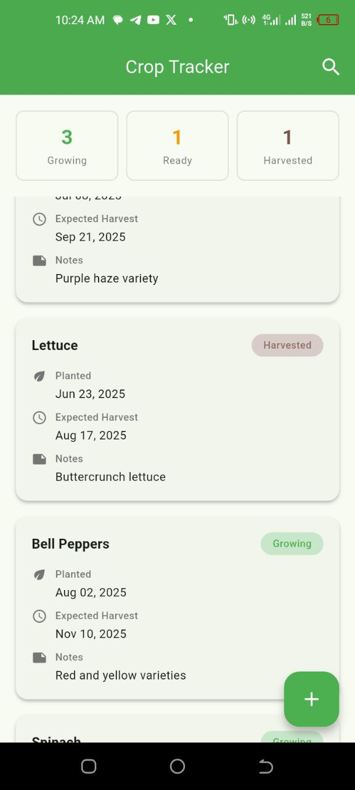
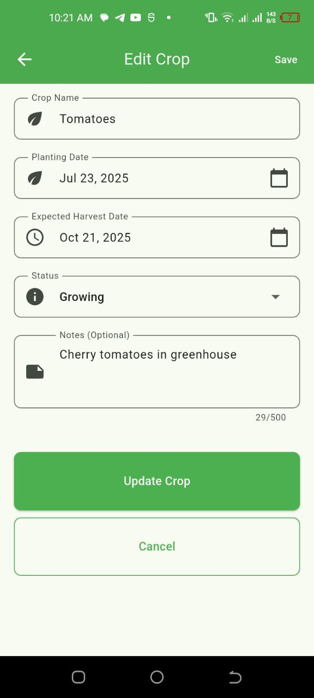
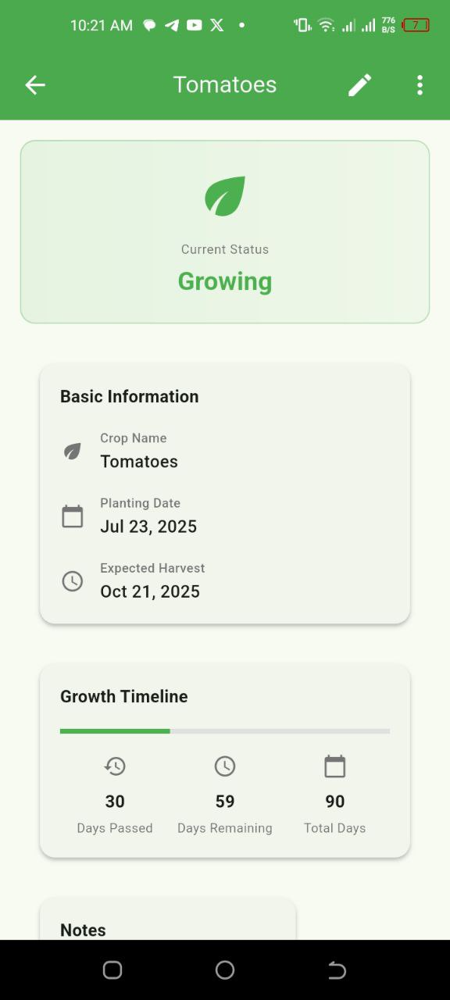

---

 ## Crop Tracker App

 Overview

The **Crop Tracker App** is a simple Flutter-based mobile application developed as part of the *Junior Flutter Developer Assignment*. It is designed to help farmers (or users) manage and track their crops by storing important details such as planting dates, harvest dates, and crop status.

---

Tech Stack

* **Flutter**: Latest stable version (3.x)
* **Dart**: Core programming language
* **State Management**: `Provider` (chosen for its simplicity and scalability for junior-level projects)
* **Local Storage**: `shared_preferences` (to persist data across app restarts)
* **UI Toolkit**: Material Design with basic theming 

---

## App Features

1. Home Screen (Crop List)

* Displays a list of crops with:

  * Name
  * Planting Date
  * Expected Harvest Date
  * Status (e.g., *Growing*, *Ready*, *Harvested*)
* Persists data using local storage.
* Includes a Floating Action Button to add a new crop.

 2. Add Crop Screen

* Form-based screen to input:

  * Crop Name
  * Planting Date 
  * Expected Harvest Date 
  * Notes 
* Validates inputs (e.g., planting date must be before harvest date).

 3. Crop Detail Screen

* Shows full details of a selected crop.
* Allows users to:

  * **Edit** crop details
  * **Delete** crop (with confirmation)
  * **Update Status** (e.g., mark as *Harvested*)

 4. Bonus Features

* Search/filter crops by name.
* Theming with agricultural color palette.
* Snackbar notifications for actions (add/edit/delete).

---

Project Structure

```plaintext
lib/
├── main.dart                 
├── models/
│   └── crop.dart            
├── providers/
│   └── crop_provider.dart   
├── screens/
│   ├── home_screen.dart     
│   ├── add_crop_screen.dart 
│   ├── edit_crop_screen.dart
│   └── crop_detail_screen.dart 
├── widgets/
│   ├── crop_card.dart      
│   ├── crop_form.dart       
│   └── status_chip.dart     
├── services/
│   └── storage_service.dart 
└── utils/
    ├── constants.dart       
    └── validators.dart      
```

---

Setup Instructions

1. **Clone the Repository**

   ```bash
   git clone https://github.com/anchirinaahhezekiah/crop_tracker
   cd crop_tracker
   ```

2. **Install Dependencies**

   ```bash
   flutter pub get
   ```

3. **Run the App**

   ```bash
   flutter run
   ```

> **Note**: You can run the app on either Android or iOS. This project was primarily tested on Android.

---

State Management Choice

This project uses **Provider** because:

* It is simple to learn and implement (ideal for junior-level projects).
* It integrates well with Flutter’s widget tree.
* It allows separation of business logic from UI, making the codebase maintainable.

Alternatives like **Riverpod** or **Bloc** are more powerful but add complexity, which was avoided to keep the project lightweight.

---

Assumptions & Limitations

* No backend is used; all data is stored locally on the device.
* Mock data (5 crops) is used for demonstration.
* The app is a **prototype**, so advanced features like cloud sync or user accounts are not implemented.

---

Testing

* A simple **unit test** is included to validate crop date logic (ensuring planting date is earlier than harvest date).

---

Screenshots 

### HomePage



### EditPage



### Status



---
